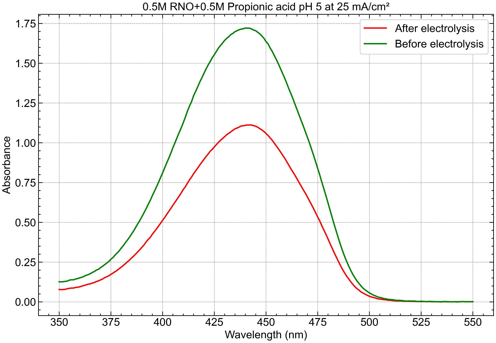

# UV
README.md — UV-Vis Absorbance Plotter (Before vs. After Electrolysis)
markdown
Copy
Edit
# 🌈 UV-Vis Absorbance Plotter — Electrochemical Comparison

This repository provides a Python script for visualizing **UV-Vis absorbance spectra** before and after electrolysis. It is tailored for **UV data exported as `.txt` files** (commonly with comma and tab formatting issues) and generates a clean, labeled plot of absorbance vs. wavelength.

---

## ✅ Features

- Reads and reformats `.txt` UV-Vis files with header rows and inconsistent delimiters
- Plots absorbance curves for **before and after electrolysis**
- Custom styling using `SciencePlots` and `matplotlib`
- Saves figure as high-resolution `.png`

---

## 📊 Example Output

Below is a representative output from the script showing the absorbance spectra:



---

## 📁 Input File Format

Export the UV data as a `.txt` file with at least 4 header lines. The absorbance data should start from **line 5** onward, with:
- First column: Wavelength (nm)
- Second column: Absorbance

Example structure:
<some metadata> <some metadata> ... Wavelength (nm) Absorbance 200 0.112 201 0.120 ... ```
If decimals are commas (European format), or tabs are used, the script handles conversion internally.

⚙️ How to Use
Export UV-Vis data as .txt (include at least 4 metadata/header lines).

Place files in the same folder as the script and rename as:

R2after.txt

R2before.txt

Run the script:

bash
Copy
Edit
python UV.ipynb
Output figure saved as:

Copy
Edit
R2.png
🧪 Script Summary
Files processed:

R2 after.txt (after electrolysis)

R2 before.txt (blank or before electrolysis)

pH Condition: 5

Electrolysis condition: 25 mA/cm²

Final Plot: Absorbance vs. Wavelength

🖼 Custom Plot Style
Styled with science, notebook, and grid layout from SciencePlots

Uses Arial font

Red = After electrolysis

Green = Before electrolysis

Transparent background for seamless integration in presentations

📦 Requirements
Install dependencies with:

bash
Copy
Edit
pip install pandas matplotlib SciencePlots
Ensure your matplotlib setup can load the science style.

🐍 Included Script
This repo contains:

Copy
Edit
UV.ipynb
It:

Cleans up .txt formatting

Converts strings to numeric

Produces side-by-side comparative plots

📬 License & Contributions
Open to collaboration — feel free to fork or submit pull requests!
